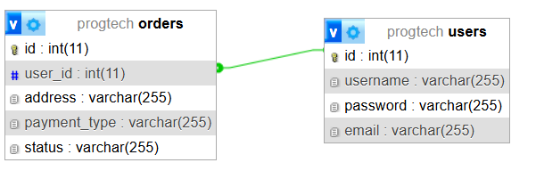

# Rendszerterv

## 1. A rendszer célja

Az alkalmazás célja egy egyszerű, de jól strukturált pizzarendelő rendszer biztosítása, amely lehetővé teszi a felhasználók számára pizzák rendelését különféle feltétekkel és többféle fizetési móddal. A rendszer célja továbbá, hogy a felhasználók nyomon követhessék rendeléseik állapotát.

## 2. Projektterv

### 2.1 Projektszerepkörök, felelőségek:
  * Üzleti szereplő:
	  -   Megrendelő:
		  -  Herbák Marcell

### 2.2 Projektmunkások és felelőségek:
   * Tesztelés:
     - Góga Dávid
     - Prokaj István

### 2.3 Ütemterv

| Funkció              | Feladat                        | Prioritás | Becslés (nap) | Aktuális becslés | Eltelt idő | Becsült idő |
|----------------------|--------------------------------|-----------|---------------|------------------|------------|--------------|
| Rendszerterv         | Dokumentáció elkészítése       | 1         | 1             | 1                | 1          | 1            |
| Alapfunkciók         | Rendelés logika                | 2         | 3             | 3                | 1          | 2            |
| Tervezési minták     | Decorator, Observer, Strategy  | 2         | 2             | 2                | 0          | 2            |
| Regisztráció/Login   | Hitelesítési rendszer          | 3         | 2             | 2                | 1          | 1            |
| Tesztelés            | Egység- és integrációs tesztek | 4         | 1             | 1                | 0          | 1            |

### 2.4 Mérföldkövek:
   *   04.07. Projekt elkezdése
   *   04.20. Alap prototípus elkészítése
   *   05.11. Végleges prototípus elkészítése
   *   05.11. Tesztelés
   *   05.14. Bemutatás és átadás

## 3. Üzleti folyamatok modellje

### 3.1 Üzleti szereplők
Az alkalmazás regisztráció vagy bejelentkezés után válik elérhetővé, bárki tud regiszrálni. Minden felhasználó ugyanolyan jogkörrel rendelkezik.

### 3.2 Üzleti folyamatok

- Regisztráció és belépés
- Pizza kiválasztása
- Feltétek hozzáadása
- Fizetési mód kiválasztása
- Rendelés leadása
- Rendelés státuszának követése

## 4. Követelmények

### Funkcionális követelmények

| ID  | Megnevezés                 | Leírás |
|-----|----------------------------|--------|
| K1  | Regisztráció               | Új felhasználó regisztrálhat a rendszerbe. |
| K2  | Bejelentkezés              | A felhasználó bejelentkezhet a fiókjába. |
| K3  | Pizza kiválasztása         | Pizza alapjának kiválasztása. |
| K4  | Feltétek hozzáadása        | A felhasználó további feltéteket adhat hozzá a pizzához. |
| K5  | Fizetési mód választás     | Választhatunk többféle fizetési mód közül. |
| K6  | Rendelés leadása           | A felhasználó leadhatja rendelését. |
| K7  | Rendelés státusz követése  | A felhasználó nyomon követheti rendelése állapotát. |

### Nemfunkcionális követelmények

| ID  | Megnevezés                         | Leírás |
|-----|------------------------------------|--------|
| K8  | Könnyen kezelhető felhasználói felület | A felületek könnyen használhatóak, átláthatóak legyenek, intuitívak, illetve ne legyenek zsúfoltak. |
| K9  | Tervezési minták alkalmazása       | A rendszer használja a Decorator, Observer és Strategy mintákat. |

### Támogatott eszközök

 * Bármely Java alkalmazás futtatásra képes eszköz. Például otthoni számítógép, laptop, tablet. Preferáltabb Windows alapú rendszer.

## 5. Funkcionális terv

### 5.1 Rendszerszereplők
 - Felhasználó
   - Rendelést adhat le ami megfelel az ízlésének, majd nyomonkövetheti annak állapotát.

### 5.2 Menühierarchiák

- **Főmenü**
  - Bejelentkezés / Regisztráció
  - Pizza kiválasztás
    - Feltét hozzáadás
    - Fizetési mód kiválasztása
  - Rendelés állapot megtekintése
  - Kijelentkezés

## 6. Fizikai környezet

### Vásárolt szoftverkomponensek, valamint esetleges külső rendszerek
Nincsenek vásárolt szoftverkomponensek.
### Hardver topológia
Olyan számítógép alkalmas, amely Windows 10 vagy 11 operációs rendszerrel rendelkezik.
### Fizikai alrendszerek
Kliens gép: A teljes alkalmazás egyetlen gépen fut, beleértve a felhasználói felületet, üzleti logikát és az esetleges adatkezelést
Adatkezelés: Az alkalmazás a rendeléseket és felhasználói adatokat lokálisan tárolja.
### Fejlesztő eszközök
 - IntelliJ IDEA
 - XAMPP (MySQL)

## 7. Architekturális terv

### Adatbázis rendszer

- MySQL alapú adatbázis.

### A program elérése, kezelése

- XAMPP, aminek a telepítése után elérhető a MySQL alapú adatbázis.

## 8. Adatbázis terv

## 9. Implementációs terv
A frontend JavaFX segítségével készül, míg a backend Java keretrendszerben.

A XAMPP szerver felelős az adatbázis futásáért, ezután egy adatbázis összekötő csomaggal érhetőek el az adatok a programon belül.  

A frontend és backend fejlesztési is IntelliJ környezetben történik.

## 10. Tesztterv

A tesztelés célja, hogy a rendszer és annak komponensei megfelelően működjenek.
A tesztelést a csapat minden tagja elvégzi. Ezeket az eredményeket a tagok dokumentálják. 
A tesztelés módja a unit teszt. A tesztelés során figyeljük, hogy a szoftver megfelelően működik-e.
Abban az esetben, ha számunkra megfelelő eredményt kaptunk, akkor a teszt sikeres. Ellenkező esetben sikertelen
és javításra szorul a hibás kódrész.

### Tesztesetek

#### Tesztelés módja: Unit Teszt

 | Teszteset            | Elvárt eredmény                                                                                            | 
 |----------------------|------------------------------------------------------------------------------------------------------------| 
 | Regisztráció         | A felhasználó az adatok megadásával sikeresen regisztrálni tud.                                            |
 | Bejelentkezés        | A felhasználó az adatok megadásával sikeresen be tud jelentkezni.                                          |
 | Pizza kiválasztás    | Az elérhető pizzák közül tud választani a felhasználó.                                                     |
 | Feltét kiválasztása  | Egy adott pizzához tartozó extra feltétek kiválasztása.                                                    |
 | Fizetési mód         | A felhasználó a rendelés leadásakor tud előre megadott fizetési módok közül választani.                    |
 | Rendelés állapota    | A felhasználó nyomon tudja követni a leadott rendelését.                                                   |

## 11. Telepítési terv

**Fizikai telepítési terv**:
 - A felhasználónak szüksége van egy számítógépre.
 - A program működéséhez szükség van egy szerverre, jelen esetben XAMPP MySQL szerverre.

**Szoftver telepítési terv**:
 - A felhasználónak szüksége van egy Windows 10 vagy 11 operációs rendszerrel rendelkező számítógépre, amin futtatható Java alkalmazás.
 - A szoftver működéséhez szükség van egy MySQL szerverre:
   - A szervert a XAMPP fogja biztosítani.
 - Az alkalmazás (frontend, backend) beállításához IntelliJ fejlesztői környezetre van szükség
 - A megfelelő konfigurálás esetén a program futtatható és a felhasználó számára elérhető állapotban van.

## 12. Karbantartási terv
*	Az alkalmazáson keresztül nem érhetőek el más felhasználók személyes adatai, csakis a bejelentkezett felhasználó adatai.
* A felhasználók által érkezett bármilyen jellegű hiba mihamarabbi javításra kerül.